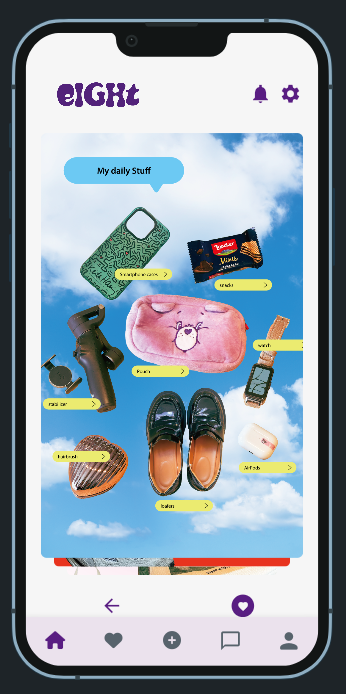
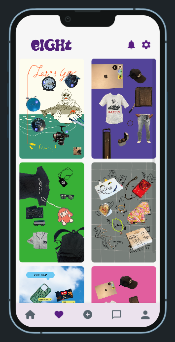
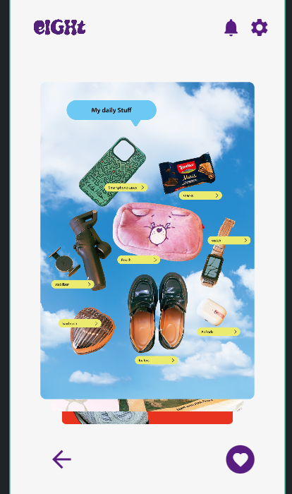
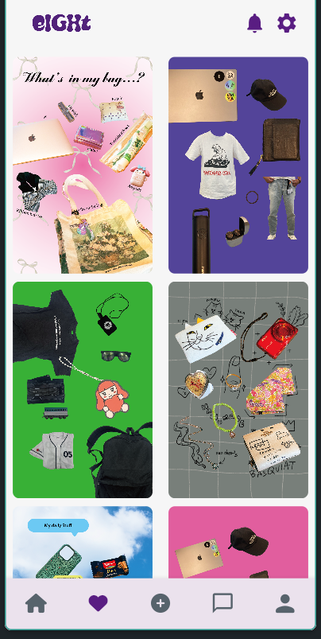
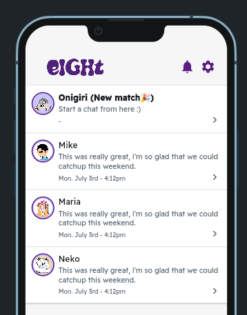
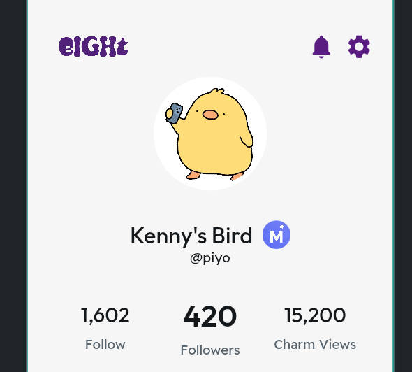
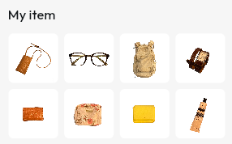
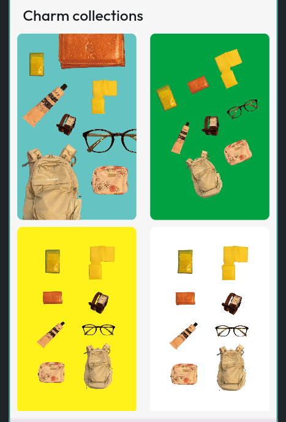

<!-- header -->
<h1 align="center">
    
</h1>
 

## Demo App
Demo:https://eight2-ee1qxc.flutterflow.app/
 

## eight' Vision
Connecting by your charm
 

## App Image

## 機能
| ホーム画面 | マッチ画面 |
| ---- | ---- |
|  |  |
| 他のユーザのCharmが見れます。素敵なCharmにはリアクションを送ってみましょう。 | Charmでリアクションを送り合うとマッチします。 |

| Charm一覧 | チャット画面 |
| ---- | ---- |
|  |  |
| リアクションを送ったCharmが確認可能になります。 | Charmで気の合った相手とチャットが可能になります。 |

| プロフィール | マイアイテム |
| ---- | ---- |
|  |  |
| プロフィール画像、フォロワー/フォロー数、Charmのビュー数が表示されます。 | ユーザが登録しているアイテム8個を確認することができます。 |

| Charmコレクション |  |
| ---- | ---- |
|  |  |
| ユーザの過去のCharmが表示されます。 |  |

## 使用技術
| Category          | Technology Stack                                     |
| ----------------- | --------------------------------------------------   |
| App　　           |  Flutter Flow　　　　　　　　　　　　                  |
| Database          | FireBase                                           |
| Design            | Figma, Figjam                                                |
| etc.              | Git, GitHub                                          |

## 検証事項
| Category | more info |
| -------- | ---------------- |
| 物のカテゴリー識別 | MercariUSの既存の技術 |
| マッチングアルゴリズム |  |
| プライバシーポリシー |  |
| セキュリティポリシー |  |

## 制作過程

figma: https://www.figma.com/design/WRUUK764n5IhtdYHguBxkV/MercariBOLD?node-id=0-1&t=eSbm6xUanrmCZ5Bp-0

figjam: https://www.figma.com/board/U6GthCGdcAU1NM10oL4lJo/MercariBOLD?node-id=0-1