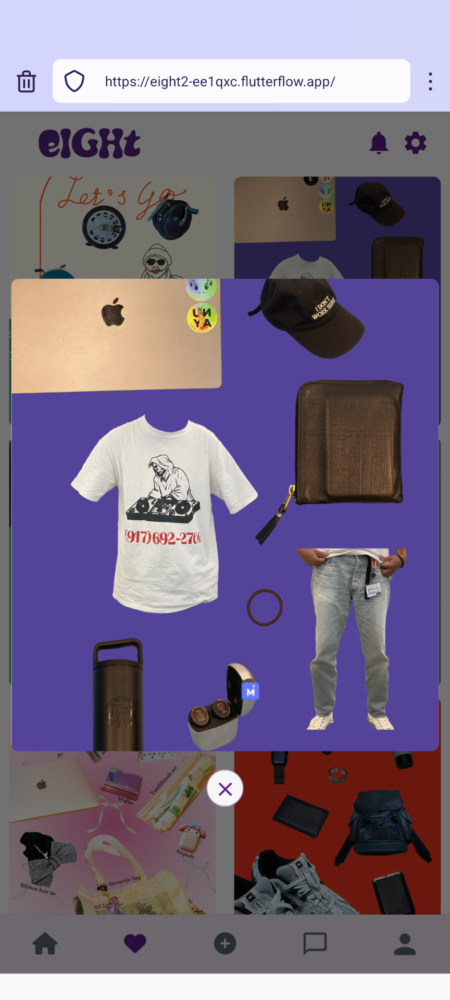
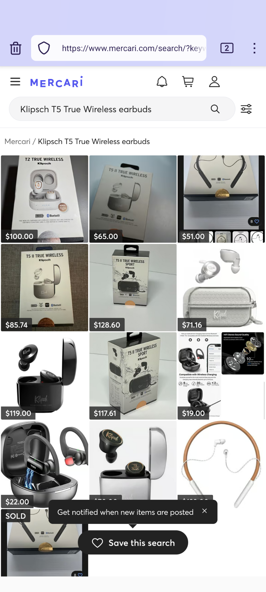

<!-- header -->
<h1 align="center">
    
</h1>
 

## Demo App

 
Demo:https://eight2-ee1qxc.flutterflow.app/
 

## eight' Vision
Connecting by your CHARM
 

## App Image

## 機能
| HOME | MATCH |
| ---- | ---- |
|  |  |
| 他のユーザのCHARMが見れます。素敵なCHARMにはリアクションを送ってみましょう。 | CHARMでリアクションを送り合うとマッチします。 |

| Fovourite CHARM | マッチした相手とのChat |
| ---- | ---- |
|  |  |
| お気に入りのCHARMが見れます。 | CHARMで気の合った相手とChatが可能になります。 |

| CHARM Detail | Move to Mercari US |
| ---- | ---- |
|  |  |
| お気に入りのCHARMをクリックすると拡大表示されます。`M`が付いている物を長押しすると物の品名と値段が表示されます。 | `M`が付いている物をダブルクリックするとMercari USで出品されている同じ商品の検索画面となります。 |

| Profile | My item |
| ---- | ---- |
|  |  |
| プロフィール画像、フォロワー/フォロー数、CHARMのビュー数が表示されます。 | 登録している8つのアイテムを確認することができます。 |

| CHRM Collections |  |
| ---- | ---- |
|  |  |
| 過去のCharmを確認することができます。 |  |

## 使用技術
| Category          | Technology Stack                                     |
| ----------------- | --------------------------------------------------   |
| App　　           |  Flutter Flow, Flutter　　　　　                  |
| Database          | FireBase                                           |
| Design            | Figma, FigJam                                                |
| etc.              | Git, GitHub                                          |

## 検証事項
| Category | MoreInfo |
| -------- | ---------------- |
| LLMによるカテゴリー検出 |  |
| APIを使用した背景切り抜き |  |

## 制作過程

 
Figma: https://www.figma.com/design/WRUUK764n5IhtdYHguBxkV/MercariBOLD?node-id=0-1&t=eSbm6xUanrmCZ5Bp-0
 
 

 
FigJam: https://www.figma.com/board/U6GthCGdcAU1NM10oL4lJo/MercariBOLD?node-id=0-1

## 機能詳細
### Matching
- Swipe
 - Right Swipe: 好みのCHARMだった場合、右へスワイプ。
 - Left Swipe: 好みではないCHARMだった場合、左へスワイプ。
- Matching Algorithm
 - 画像認識->Image embedding->類似度計算
  - 画像から計算されるベクトルとユーザインプットのカテゴリやタグから類似度を計算し、類似度が高いものから優先的にHome画面に表示する。
 - 類似度の高いチャームだけではなく、ランダムに類似性が低いものも表示する。(飽きさせないため)
- Ideas
 - Mode: Dating mode/Friends monde
  - パートナー探しをしたい人、友達を探したい人で分け、モードを指定することでマッチングする相手を変えられるようにする。

### Likes
- Charm Lists
 - CHARMをクリックすると詳細の確認ができる。
 - `M`マークを長押しすると、物の品名/値段が表示される。
 - `M`マークをダブルクリックすると、同じ物が並ぶMercariUSへの画面へと遷移する。

### Create
- Create CHARM
 - 自分の8個の物からCHARMを作成。
- Image Editing
 - CHARMを作成する画像の背景を切り抜き、CHARM上に自由に配置可能とする。
 - 文字やスタンプで自由に装飾可能とする。

### Profile
- Connecting with MercariUS
 - MercariUSとのアカウント連携を可能に。
- My Items
 - 自分の8個の登録アイテムを確認できる。
- CHARM Collections
 - 自分のCHARMのコレクションを確認できる。

### Others

## 発表資料
