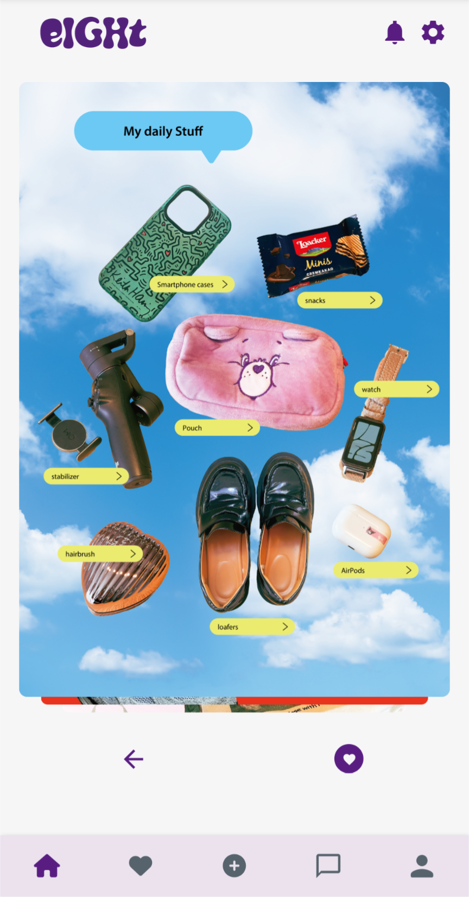
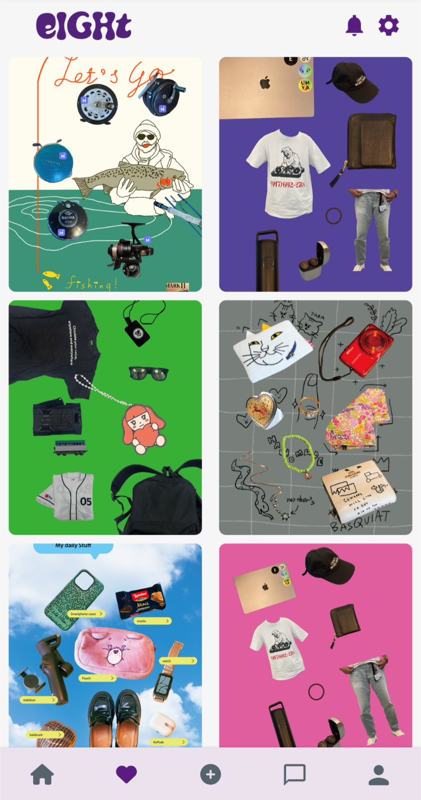
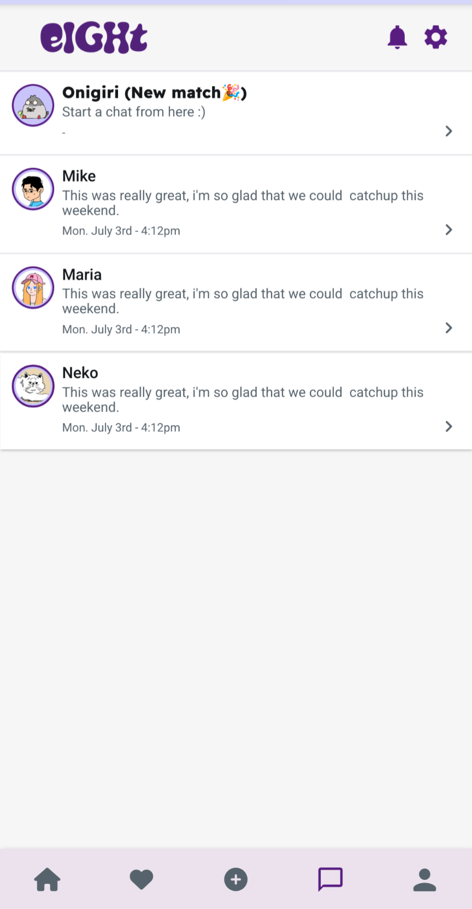
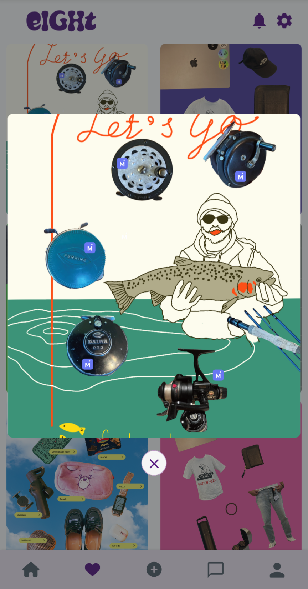
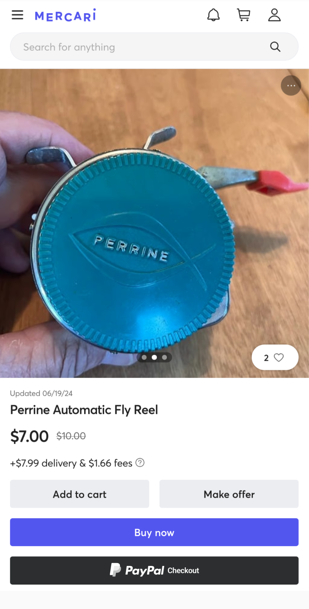
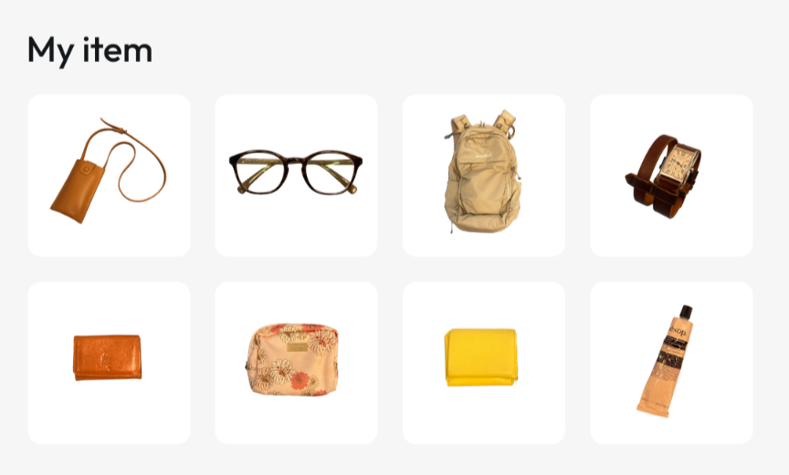
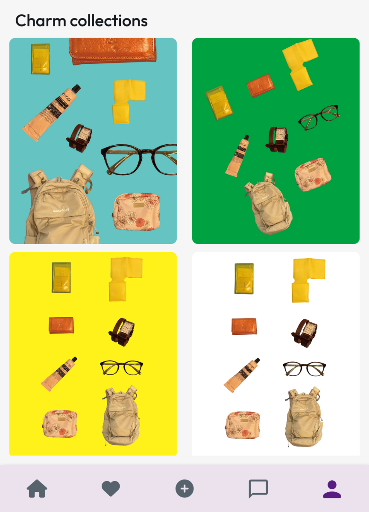
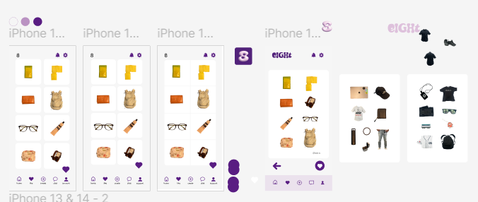
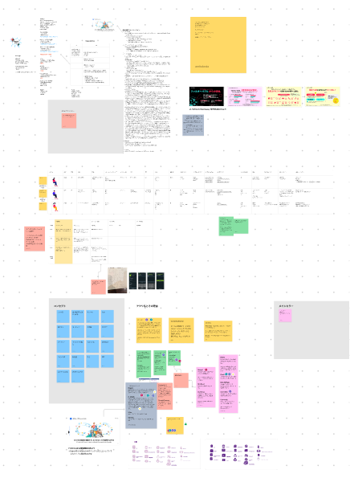

<!-- header -->
<h1 align="center">
    
</h1>
 

## Demo App

 
Demo:https://eight2-ee1qxc.flutterflow.app/
 

## eight' Vision
Connecting by your CHARM
 

## App Image

## 機能
| HOME | MATCH |
| ---- | ---- |
|  |  |
| 他のユーザのCHARMが見れます。素敵なCHARMにはリアクションを送ってみましょう。 | CHARMでリアクションを送り合うとマッチします。 |

| Fovourite CHARM | マッチした相手とのChat |
| ---- | ---- |
|  |  |
| お気に入りのCHARMが見れます。 | CHARMで気の合った相手とChatが可能になります。 |

| CHARM Detail | Move to Mercari US |
| ---- | ---- |
|  |  |
| お気に入りのCHARMをクリックすると拡大表示されます。 | `M`が付いている物をクリックするとMercari USの商品ページへと繋がります。 |

| Profile | My item |
| ---- | ---- |
|  |  |
| プロフィール画像、フォロワー/フォロー数、CHARMのビュー数が表示されます。 | 登録している8つのアイテムを確認することができます。 |

| CHRM Collections |  |
| ---- | ---- |
|  |  |
| 過去のCharmを確認することができます。 |  |

## 使用技術
| Category          | Technology Stack                                     |
| ----------------- | --------------------------------------------------   |
| App　　           |  Flutter Flow, Flutter　　　　　                  |
| Database          | FireBase                                           |
| Design            | Figma, FigJam                                                |
| etc.              | Git, GitHub                                          |

## 検証事項
| Category | MoreInfo |
| -------- | ---------------- |
| LLMによるカテゴリー検出 |  |
| APIを使用した背景切り抜き |  |

## 制作過程

 
Figma: https://www.figma.com/design/WRUUK764n5IhtdYHguBxkV/MercariBOLD?node-id=0-1&t=eSbm6xUanrmCZ5Bp-0
 
 

 
FigJam: https://www.figma.com/board/U6GthCGdcAU1NM10oL4lJo/MercariBOLD?node-id=0-1