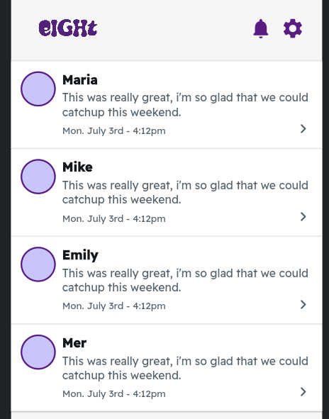

<!-- header -->
<h1 align="center">
    
</h1>
 

## Demo App
Connecting by your charm
Demo URL: 

## eight' Vision

## App Image

    

    

 

## 機能
| ホーム画面 | マッチ画面 |
| ---- | ---- |
|  |  |
| 他のユーザのCharmが見れます。素敵なCharmにはリアクションを送ってみましょう。 | Charmでリアクションを送り合うとマッチします。 |

| Charm一覧 | チャット画面 |
| ---- | ---- |
|  |  |
| リアクションを送ったCharmが確認可能になります。 | Charmで気の合った相手とチャットが可能になります。 |

| プロフィール | マイアイテム |
| ---- | ---- |
|  |  |
| プロフィール画像、フォロワー/フォロー数、Charmのビュー数が表示されます。 | ユーザが登録しているアイテム8個を確認することができます。 |

| Charmコレクション |  |
| ---- | ---- |
|  |  |
| ユーザの過去のCharmが表示されます。 |  |

## 使用技術
| Category          | Technology Stack                                     |
| ----------------- | --------------------------------------------------   |
| App　　           |  Flutter Flow　　　　　　　　　　　　                  |
| Database          | PostgreSQL                                           |
| Design            | Figma                                                |
| etc.              | Git, GitHub                                          |

## 検証事項
| Category | more info |
| -------- | ---------------- |
| 物のカテゴリー識別 | MercariUSの既存の技術 |
| マッチングアルゴリズム |  |
| プライバシーポリシー |  |
| セキュリティポリシー |  |